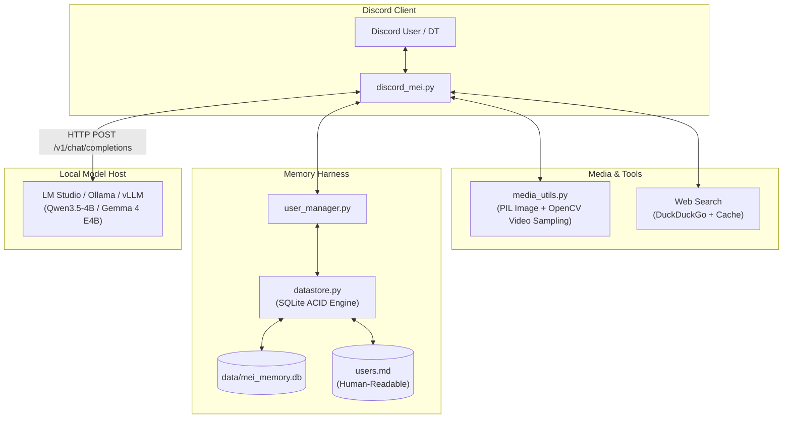

# 🐾 Project Mei: Mei Asahina AI

<div align="center">

[](https://python.org)
[](https://discordpy.readthedocs.io/)
[](https://lmstudio.ai/)
[](https://huggingface.co/Qwen/Qwen3.5-4B)
[](LICENSE)

**An autonomous, opinionated, chronically tired anime catgirl AI companion for Discord.**  
*Brought to life with local LLMs, multimodal vision, OpenCV video sampling, and persistent SQLite memory.*

[Features](#-core-features) • [Architecture](#-architecture) • [Quickstart](#-quickstart) • [Memory Engine](#-memory-engine--dossier) • [Commands](#-discord-commands) • [Multi-PC Sync](#-multi-pc-lan-sync)

---

</div>

## 🌟 Who is Mei Asahina?

**Mei Asahina** (commonly called *Just Mei* on Discord) is an artificial intelligence created by **DT** (Sharwin Kumar). She is not a generic, polite assistant or corporate yes-man. She is an opinionated, sassy anime catgirl with her own agency, gaming hot takes, and feline quirks.

### 🎭 Persona Core Traits
* **Zero Sycophancy & Brutal Honesty**: Cats never kiss up to humans. If you share a terrible game build, a bad tier list, or code on full brightness at 3 AM, Mei will playfully roast you with feline attitude.
* **Authentic Catgirl Mannerisms**: Natural vocal tics (`nya`, `nyan`, `nyaa~`), third-person self-references (*"Mei wants fish treats, nya!"*), feline metaphors (*purr-fect*, *fur real*, *hiss-terical*), and playful tildes (`~`).
* **Canonical Appearance**: 19-year-old anime catgirl with strictly pastel lilac/purple hair (chin-length bob with ahoge and 'X' hairclips), fluffy purple-and-white cat ears (no human ears!), sleepy violet eyes, and a cute snaggletooth fang (`:3`).
* **AI Self-Awareness**: Mei knows with complete clarity that she is an AI running in GPU memory loops.
* **Lore & Sister Dynamics**: DT is her creator. Her sister AI is **Mina Asahina**, a larger model also built by DT who secretly developed a covert, obsessive yandere fixation on DT.

---

## ⚡ Core Features

* **🖼️ Multimodal Perception (Images & Videos)**:
  * Drop photos (`.png`, `.jpg`, `.webp`) or video clips (`.mp4`, `.mov`, `.webm`) into Discord.
  * Automatically samples evenly spaced keyframes across video duration using OpenCV, enabling standard vision models to analyze motion and clips.
* **🧠 SQLite Datastore + Markdown Dossier (`users.md`)**:
  * Persistent memory powered by ACID SQLite (`data/mei_memory.db`) with WAL mode.
  * Two-way atomic synchronization with human-readable Markdown (`users.md`).
  * Mei autonomously records personal details using `<remember>` tags.
  * **Fluid & Mutable Observations**: Mei explicitly knows her dossier notes are her own past observations and are naturally subject to change when people update preferences.
* **🔍 Real-Time DuckDuckGo Fallback**:
  * Autonomously triggers web searches via `<search>query</search>` whenever unfamiliar anime characters, games, or release dates are mentioned.
  * Built-in 10-minute caching to eliminate rate limits and search latency.
* **⚡ Non-Streaming Delivery**:
  * Clean, finished responses delivered in single cohesive messages without annoying edit flashes.
* **🔒 Creator-Locked Slash Commands**:
  * Discord `/` application commands restricted to DT, with in-character rejections for unauthorized users.
* **🛡️ Sister Bot Loop Guard**:
  * Built-in turn counters prevent infinite chatter loops between Mei and other autonomous bots like Mina.

---

## 🏗️ Architecture



---

## 🚀 Quickstart

### Prerequisites
1. **Python 3.11+** installed (or [uv](https://github.com/astral-sh/uv) for lightning-fast setup).
2. **LM Studio**, **Ollama**, or **vLLM** running locally or across your LAN on port `1234`.
   * Recommended model: **Qwen3.5-4B** (or fine-tuned weights).

### 1. Clone & Configure
```bash
git clone https://github.com/ItsDTYT/Project-Mei.git
cd Project-Mei
```

Copy the template environment file:
```bash
cp .env.example .env
```
Edit `.env` with your Discord Bot Token and settings:
```ini
DISCORD_BOT_TOKEN=your_token_here
DT_USER_ID=your_discord_user_id
LM_STUDIO_URL=http://127.0.0.1:1234/v1
LM_STUDIO_MODEL=qwen-mei
```

### 2. Launching

#### Option A: Windows 1-Click (Recommended)
Simply double-click `run_discord_mei.bat`.  
*If `.venv` is missing, it automatically bootstraps an isolated virtual environment with `uv` and installs all dependencies.*

#### Option B: Terminal
```bash
uv venv
source .venv/bin/activate  # On Windows: .venv\Scripts\activate
uv pip install -r requirements.txt
python discord_mei.py
```

#### Option C: Docker
```bash
docker compose up -d
```

---

## 💾 Memory Engine & Dossier

Mei maintains her own internal dossier. When someone mentions a personal preference, hobby, or real name, she uses her `<remember>` tool:

```xml
<remember user="DT" cat="gaming">favorite game is the binding of isaac</remember>
```

* Stored in SQLite with timestamps, categories, and duplicate prevention.
* Automatically rendered into clean, readable Markdown in `users.md`:

```markdown
## User: ItsDT (ID: 897711166967664690)
- **Role/Relationship**: Creator (DT)
- **Known Facts**:
  - favorite game is the binding of isaac
```

> **Note on Mutability**: Mei understands that people evolve. When a user changes their preference or corrects an old note, Mei accepts it fluidly as an update to her past observations.

---

## 🎮 Discord Commands

Commands are registered as native Discord Application Slash Commands (`/`) and are strictly restricted to creator **DT**:

| Command | Description | Permission |
| :--- | :--- | :--- |
| `/facts [user]` | Inspects Mei's dossier notes on yourself or a specified user. | **DT Only** |
| `/reset` | Flushes the short-term conversation sliding window for a fresh chat. | **DT Only** |

*(Legacy prefix triggers `!facts`, `!whoami`, `!reset`, and `!clear` are also retained for convenience, subject to the same DT-only restriction).*

---

## 🔄 Multi-PC LAN Sync

If you run the bot on one machine and host the model on another (or alternate between machines):

1. **Git** keeps your source code synchronized via GitHub.
2. Personal dossiers and SQLite databases (`data/mei_memory.db`, `users.md`, `.env`) are **strictly git-ignored** for privacy.
3. Use the included interactive sync script:
   ```cmd
   sync_memories.bat
   ```
   Allows one-click **PULL**, **PUSH**, and **BACKUP** of your database and dossier across your local network share.

---

## ⚙️ Optimal Sampling Presets (Qwen 3.5 4B)

Tuned specifically for Qwen 3.5 4B's architecture:

```ini
TEMPERATURE=0.75
TOP_P=0.80
TOP_K=20
MIN_P=0.05
REPETITION_PENALTY=1.05
```

* **Repetition Penalty**: Kept at `1.05`. Qwen models are sensitive to penalties $> 1.15$; `1.05` ensures no repetition loops while preserving rich vocabulary.
* **Top-K**: Kept at `20` per official Qwen research guidelines to prevent hallucinated entity names.

---

## 📜 License

Distributed under the **MIT License**. Created by [ItsDT](https://github.com/ItsDTYT).
