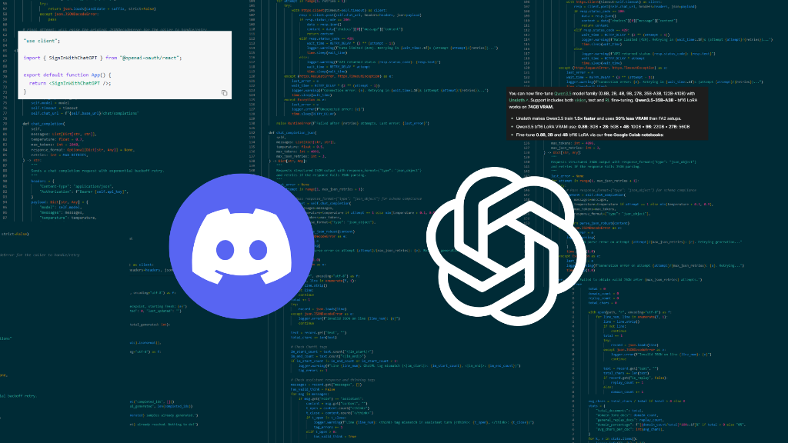
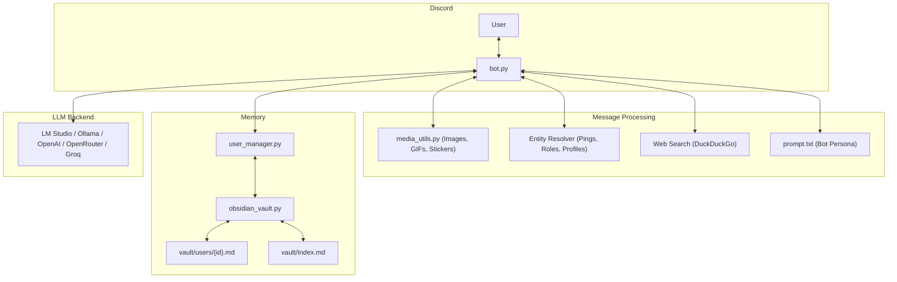

# Disco-AI

<p align="center">
  
</p>

<p align="center">
  <a href="https://python.org"></a>
  <a href="https://discordpy.readthedocs.io/"></a>
  <a href="https://obsidian.md"></a>
  <a href="LICENSE"></a>
</p>

Disco-AI is a Discord bot that works with LLMs like LM Studio, Ollama and vLLM or with cloud APIs such as OpenAI, Groq and Google. It saves user memories as Markdown notes inside an Obsidian vault. It handles images and video keyframes too. It recognizes Discord mentions. Lets you change the bot’s persona by simply editing one text file.

---

## Features

- **Talk anywhere**: The bot can chat in any channel. The bot can reply, ping or message it in messages. There are no channel restrictions.
- **Image and video support**: The bot handles pictures, animated GIFs, Discord stickers and video frames. If the current model does not support vision, the bot informs you in chat.
- **vault memory**: The bot saves member notes to `vault/users/{id}.md` with YAML frontmatter tags such as `#user` and `#disco-ai/memory` and task checkboxes. You can open the `vault/` folder directly in Obsidian to view everything in the graph view.
- **Mention and emoji cleanup**: The bot converts raw Discord IDs (`<@user_id>` `<@&role_id>` `<#channel_id>`) into user handles, role names and channel names. The bot also converts custom emojis into `:name:`.
- **User profile context**: The bot grabs profile info such as account age, server join date, roles and status/activity so the bot knows who it is talking to.
- **Custom persona, in text**: The bot allows you to change personality, tone and rules in `prompt.txt` without editing Python code.
- **DuckDuckGo search**: The bot can look up real‑time information by outputting `<search>query</search>`. Results are cached for ten minutes.
- **Terminal- thinking**: Model reasoning blocks (`<think>...</think>`) stay in your terminal console instead of cluttering chat.
- **Slash commands**: Clean `/facts`. /Reset` commands are locked to the bot owner.

---

## Quickstart

### 1. Create your Discord bot
1. Open the [Discord Developer Portal](https://discord.com/developers/applications) and click **New Application**.
2. Go to the **Bot** tab and click **Reset Token** to copy your token.
3. Turn on these **Privileged Gateway Intents**:
   - Message Content Intent
   - Server Members Intent
   - Presence Intent (optional, allows reading user activity/status)
4. Go to **OAuth2 > URL Generator**, check `bot` and `applications.commands`, pick standard message permissions, and invite the bot to your server.

### 2. Configure settings
Copy the example environment file:
```bash
cp .env.example .env
```
Edit `.env` with your bot token, owner ID, and model settings:
```ini
DISCORD_BOT_TOKEN=your_discord_bot_token
BOT_OWNER_ID=your_numeric_discord_user_id
BOT_NAME=Disco

# Local LLMs (e.g. LM Studio on port 1234):
API_BASE_URL=http://127.0.0.1:1234/v1
MODEL_NAME=qwen2.5-7b-instruct
API_KEY=

# Or for vision models:
# MODEL_NAME=qwen3.5-4b
```

### 3. Run the bot

#### Windows
Double-click `run.bat`. It will set up the virtual environment, install requirements, and launch the bot.

#### Linux / macOS / Terminal
```bash
python -m venv .venv
source .venv/bin/activate  # On Windows: .venv\Scripts\activate
pip install -r requirements.txt
python bot.py
```

#### Docker
```bash
docker compose up -d
```

---

## Architecture



---

## Commands

| Command | What it does | Who can use it |
| :--- | :--- | :--- |
| `/facts [user]` | Shows saved Obsidian vault notes for you or a selected user | Bot Owner |
| `/reset` | Clears recent conversation memory in the current channel or DM | Bot Owner |

---

## Recommended Models

### Local
- **Llama3.1 8b / Qwen 2.5 7B**: Great for text chat and fast responses.
- **Qwen 3.5 (4B or 8B) / Gemma4 12-e4-2b**: Recommended if you want image and GIF understanding locally.
- **MiniCPM-V 2.6**: Strong local vision model.

### Cloud
- **Gemini 3.8 Flash**: Fast, cheap, and handles vision and text easily.
- **GPT-5.6-Terra**: Reliable reasoning and multimodal support.

---

## Viewing Memories in Obsidian

Disco-AI stores memories directly as markdown notes:
1. Open the [Obsidian](https://obsidian.md) desktop app.
2. Select **Open folder as vault** and choose the `vault/` directory inside this project.
3. Open `Index.md` or check out the Graph View to see users and saved facts linked together.

---

## Documentation

Check the [Wiki](wiki/Home.md) for more details:
- [Getting Started Guide](wiki/Getting-Started.md)
- [Model Setup Guide](wiki/Model-Setup-Guide.md)
- [Customizing Personas & Memory](wiki/Customizing-Personas.md)
- [Troubleshooting & FAQ](wiki/Troubleshooting.md)

---

## License

MIT License. See [LICENSE](LICENSE) for details.
