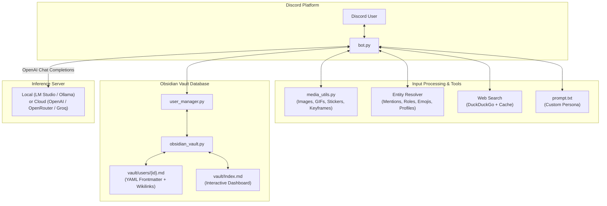

# Disco-AI

<p align="center">
  
</p>

<p align="center">
  <a href="https://python.org"></a>
  <a href="https://discordpy.readthedocs.io/"></a>
  <a href="https://obsidian.md"></a>
  <a href="LICENSE"></a>
</p>

An open-source, beginner-friendly Discord AI bot template. Disco-AI connects Discord to local LLMs (LM Studio, Ollama, vLLM) or Cloud APIs (OpenAI, OpenRouter, Groq). It features an **Obsidian Vault markdown database**, multimodal vision (images, GIFs, stickers, video frames), user profile dossier extraction, entity and mention resolution, web search fallback, and an easily editable prompt file.

---

## Features

- **Talk Anywhere**: Responds in any channel or server where invited, mentioned, replied to, or called by name—plus full direct message (DM) support without restrictive channel locks.
- **Multimodal Vision (Images, GIFs, Stickers, Videos)**: Processes static images, animated GIFs, Discord stickers, and video keyframes.
  > **Note**: A multimodal vision model is required for visual inputs. If a text-only model is loaded, the bot informs users in Discord chat that a vision model is needed.
- **Obsidian Vault Database**: Replaces traditional databases with a native Obsidian Vault (`vault/`). Every user receives a dedicated markdown note (`vault/users/{id}.md`) formatted with YAML frontmatter, wikilinks (`[[User]]`), and checkbox facts (`- [x] fact`). Open `vault/` in the [Obsidian app](https://obsidian.md) to explore an interactive graph view of all bot memories!
- **User Profile Dossier Extraction**: Automatically inspects the speaker's Discord profile (account age, server join date, assigned roles, and current activity/presence) and injects this context so the AI knows who it is conversing with.
- **Smart Mention & Emoji Resolver**: Resolves raw Snowflake IDs (`<@id>`, `<@&role_id>`, `<#channel_id>`) into readable names (`@DisplayName`, `@Role`, `#channel`) and translates custom animated emojis (`<:name:id>`) into `:name:` so the model understands conversation context.
- **Custom Personas Without Code**: Edit `prompt.txt` to adjust personality, lore, and speaking style without touching Python code.
- **DuckDuckGo Web Search**: Emits `<search>query</search>` tags when a question needs recent news, game updates, or facts, cached for 10 minutes.
- **Hidden Thinking Traces**: Keeps model reasoning traces (`<think>` blocks) out of Discord chat and logs them to your terminal console.
- **Slash Commands Only**: Clean `/facts` and `/reset` slash commands restricted to the bot owner ID specified in `.env`.

---

## Quickstart

### 1. Create a Discord Bot
1. Go to the [Discord Developer Portal](https://discord.com/developers/applications) and create a New Application.
2. Under the **Bot** tab, click **Reset Token** to copy your bot token.
3. Scroll down to **Privileged Gateway Intents** and enable:
   - **Message Content Intent**
   - **Server Members Intent**
   - **Presence Intent** *(optional, enables activity/game status detection)*
4. Under **OAuth2 > URL Generator**, check `bot` and `applications.commands`, select standard messaging permissions, and invite the bot to your server.

### 2. Configure Settings
Copy the template configuration file:
```bash
cp .env.example .env
```
Open `.env` and fill in your details:
```ini
DISCORD_BOT_TOKEN=your_discord_bot_token
BOT_OWNER_ID=your_numeric_discord_user_id
BOT_NAME=Disco

# For Local LLMs (LM Studio on port 1234):
API_BASE_URL=http://127.0.0.1:1234/v1
MODEL_NAME=qwen3.5-4b
API_KEY=

# For Vision Models (LM Studio / Ollama / Cloud):
# MODEL_NAME=qwen2.5-vl-7b-instruct
```

### 3. Start the Bot

#### Windows (One-Click)
Double-click `run.bat`. The script automatically configures a virtual environment, installs dependencies, and starts the bot.

#### Linux / macOS / Terminal
```bash
python -m venv .venv
source .venv/bin/activate  # On Windows: .venv\Scripts\activate
pip install -r requirements.txt
python bot.py
```

#### Docker
```bash
docker compose up -d
```

---

## Architecture



---

## Commands

| Command | Description | Access |
| :--- | :--- | :--- |
| `/facts [user]` | Displays Obsidian Vault memory notes for yourself or a selected user. | Owner Only |
| `/reset` | Clears recent conversation history in the current channel or DM. | Owner Only |

---

## Recommended Models

### Local Models (Consumer Hardware)
- **Qwen 3.5 4B** (Recommended for Text): Fast, lightweight, and low latency. Runs comfortably within 6 GB–8 GB VRAM while following instructions and memory tags.
- **Qwen 2.5 VL (3B / 7B)** (Recommended for Vision): Excellent vision-language model capable of analyzing images, GIFs, and screenshots directly on local GPUs.
- **Gemma 4 E4B**: Google's lightweight open model with strong reasoning and conversation capabilities.
- **MiniCPM-V 2.6**: Strong local multimodal vision model with high OCR and visual comprehension.

### Cloud Models (API Providers)
- **Gemini 2.0 Flash / Gemini 3.8 Flash**: Extremely fast, multimodal by default (images, audio, video), with generous context windows.
- **ChatGPT 5.6 (Luna / Terra) / GPT-4o**: State-of-the-art reasoning, vision, and instruction adherence.

---

## Obsidian Vault Integration

Disco-AI organizes memory as a native **Obsidian Vault**:
1. Open the [Obsidian app](https://obsidian.md).
2. Click **Open folder as vault** and select the `vault/` directory inside Disco-AI.
3. Enjoy an interactive graph view connecting users, memory tags (`#user`, `#disco-ai/memory`), and live dossier notes!

---

## Documentation & Wiki

For step-by-step guides, see the [Disco-AI Wiki](wiki/Home.md):
- [Getting Started Guide](wiki/Getting-Started.md)
- [Model Setup Guide (Local & Cloud)](wiki/Model-Setup-Guide.md)
- [Customizing Personas & Memory](wiki/Customizing-Personas.md)
- [Troubleshooting & FAQ](wiki/Troubleshooting.md)

---

## License

Distributed under the [MIT License](LICENSE).
