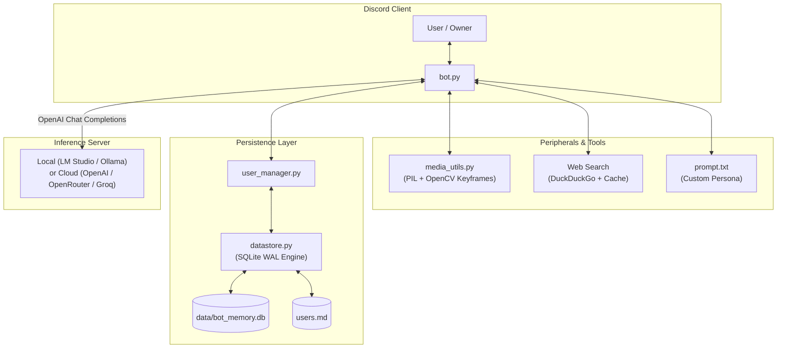

# Disco-AI

<p align="center">
  <a href="https://python.org"></a>
  <a href="https://discordpy.readthedocs.io/"></a>
  <a href="LICENSE"></a>
</p>

An open-source, beginner-friendly Discord AI bot template. Disco-AI connects Discord to local LLMs (LM Studio, Ollama, vLLM) or Cloud APIs (OpenAI, OpenRouter, Groq). It includes persistent SQLite memory, image and video understanding, web search fallback, and an easily editable prompt file.

---

## Features

- **Local LLMs & Cloud APIs**: Connect to local backends (LM Studio, Ollama, vLLM) or paste an API key for cloud providers (OpenRouter, OpenAI, Groq).
- **Custom Personas Without Code**: Edit `prompt.txt` to change your bot's personality, lore, and speaking style without touching Python code.
- **Vision & Video Understanding**: Resizes image attachments and extracts video keyframes with OpenCV so vision models can see pictures and short clips.
- **Persistent Memory (SQLite + Markdown)**: Stores user details in SQLite (`data/bot_memory.db`) and exports an editable plain text summary to `users.md`.
- **DuckDuckGo Web Search**: Emits `<search>query</search>` tags when a question needs recent news, game updates, or facts, cached for 10 minutes.
- **Hidden Thinking Traces**: Keeps model reasoning traces (`<think>` blocks) out of Discord chat and logs them to your terminal console.
- **Owner-Only Commands**: Restricts `/facts` and `/reset` to the bot owner ID specified in your `.env`.

---

## Quickstart

### 1. Create a Discord Bot
1. Go to the [Discord Developer Portal](https://discord.com/developers/applications) and create a New Application.
2. Under the **Bot** tab, click **Reset Token** to copy your bot token.
3. Scroll down to **Privileged Gateway Intents** and enable:
   - **Message Content Intent**
   - **Server Members Intent**
4. Under **OAuth2 > URL Generator**, check `bot` and `applications.commands`, select administrative or standard messaging permissions, and use the generated link to invite the bot to your Discord server.

### 2. Configure Settings
Copy the template configuration file:
```bash
cp .env.example .env
```
Open `.env` and fill in your details:
```ini
DISCORD_BOT_TOKEN=your_discord_bot_token
BOT_OWNER_ID=your_numeric_discord_user_id
BOT_NAME=Disco

# For Local LLMs (LM Studio on port 1234):
API_BASE_URL=http://127.0.0.1:1234/v1
MODEL_NAME=qwen3.5-4b
API_KEY=

# Or for Cloud APIs (example: OpenRouter):
# API_BASE_URL=https://openrouter.ai/api/v1
# MODEL_NAME=meta-llama/llama-3.3-70b-instruct
# API_KEY=sk-or-v1-...
```

### 3. Start the Bot

#### Windows (One-Click)
Double-click `run.bat`. The script automatically sets up a virtual environment, installs dependencies, and starts the bot.

#### Linux / macOS / Terminal
```bash
python -m venv .venv
source .venv/bin/activate  # On Windows: .venv\Scripts\activate
pip install -r requirements.txt
python bot.py
```

#### Docker
```bash
docker compose up -d
```

---

## Customizing Your Bot's Persona

Open `prompt.txt` in any text editor. You can write your own system prompt or character backstory here. When you restart the bot, it will adopt the new personality immediately.

Example:
```text
You are a grumpy tavern dwarf in a fantasy Discord server.
Speak with a gruff accent, complain about spilled ale, and give short advice.
```

---

## Architecture



---

## Commands

| Command | Description | Access |
| :--- | :--- | :--- |
| `/facts [user]` | Displays memory notes for yourself or a selected user. | Owner Only |
| `/reset` | Clears recent conversation history in the current channel or DM. | Owner Only |

Legacy prefix triggers (`!facts`, `!reset`) are also supported for the bot owner.

---

## Recommended Models

- **Local Consumer GPUs (6 GB - 8 GB VRAM)**:
  - `Qwen 3.5 4B` (Fast, low VRAM, accurate tool use)
  - `Qwen 2.5 7B`
- **Cloud Endpoints**:
  - `meta-llama/llama-3.3-70b-instruct` (OpenRouter / Groq)
  - `gpt-4o-mini` (OpenAI)

---

## License

Distributed under the [MIT License](LICENSE).
