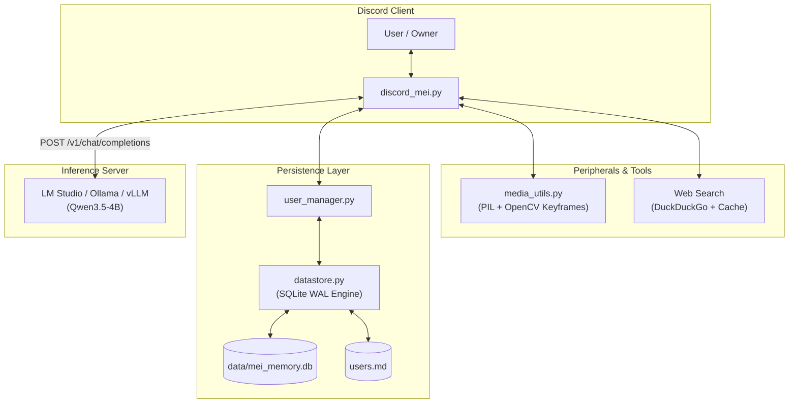

# Project Mei

<p align="center">
  
  &nbsp;&nbsp;&nbsp;&nbsp;
  
</p>

<p align="center">
  <a href="https://python.org"></a>
  <a href="https://discordpy.readthedocs.io/"></a>
  <a href="https://huggingface.co/Qwen/Qwen3.5-4B"></a>
  <a href="LICENSE"></a>
</p>

An autonomous Discord bot built for local LLM inference, featuring persistent SQLite memory, multimodal vision and video support, real-time web search fallback, and a distinct anime catgirl persona.

---

## Overview

Mei Asahina is a Discord companion designed to run entirely against local or self-hosted model backends (such as LM Studio, Ollama, or vLLM). Unlike standard assistant bots, Mei has an opinionated, feline personality with casual speech patterns, light snark, and natural conversational quirks.

### Model Recommendations & Training Note

- **Recommended Models**: For local consumer hardware, small models such as **Qwen3.5-4B** (or Qwen 2.5 3B / 7B) are strongly recommended. A 4B parameter model runs with minimal VRAM usage (fits comfortably on 6 GB–8 GB cards), maintains low latency on single-message Discord turns, and follows structured instructions reliably.
- **Custom Training Disclaimer**: Mei was originally developed using a custom-trained / fine-tuned model specifically adapted to her character voice and mannerisms. The system prompt and sampling configurations in this repository provide a working baseline for general open-weight models, but the exact prompt and output style may differ slightly from the private custom-trained setup.

---

## Features

- **Multimodal Support (Images & Video)**:
  - Supports image attachments (`.png`, `.jpg`, `.webp`) by resizing and encoding them for vision-capable endpoints.
  - Handles video files (`.mp4`, `.mov`, `.webm`) by using OpenCV to extract representative keyframes across the clip duration, allowing vision models to understand video context.
- **Persistent Memory (SQLite + Markdown Export)**:
  - Uses an ACID-compliant SQLite datastore (`data/mei_memory.db`) running in WAL mode for memory persistence.
  - Automatically syncs memory state into a clean, human-readable Markdown file (`users.md`).
  - Mei records details autonomously using `<remember>` tags.
  - **Mutable Observations**: Memories are framed as Mei's own observational notes rather than immutable rules, allowing her to adapt naturally when someone updates their preferences or corrects a detail.
- **Web Search Fallback**:
  - Automatically detects when a topic requires external knowledge (unfamiliar media, release dates, or specific character names) using `<search>query</search>` tags.
  - Queries DuckDuckGo and caches results for 10 minutes to avoid rate limits and unnecessary network calls.
- **Clean Non-Streaming Output**:
  - Waits for full model generation before posting to Discord, avoiding message-editing jitter.
  - Reasoning traces (`<think>` blocks) are filtered from chat and logged directly to the local terminal console.
- **Owner-Exclusive Commands**:
  - Slash commands (`/facts` and `/reset`) are restricted to the bot owner (`DT_USER_ID`) with in-character rejections for other users.

---

## Architecture



---

## Quickstart

### 1. Requirements
- Python 3.11 or higher (or [uv](https://github.com/astral-sh/uv))
- A running OpenAI-compatible local inference server (LM Studio, Ollama, or vLLM) on port `1234` (or configured URL)
- A Discord Bot Token with Message Content and Server Members intents enabled

### 2. Setup
Clone the repository:
```bash
git clone https://github.com/ItsDTYT/Project-Mei.git
cd Project-Mei
```

Create your configuration file from the template:
```bash
cp .env.example .env
```

Open `.env` and fill in your credentials:
```ini
DISCORD_BOT_TOKEN=your_discord_bot_token
DT_USER_ID=your_discord_numeric_id
LM_STUDIO_URL=http://127.0.0.1:1234/v1
LM_STUDIO_MODEL=qwen3.5-4b
```

### 3. Running

#### Option 1: Windows Batch Script
Double-click `run_discord_mei.bat`. If a virtual environment is not found, the script will automatically initialize one using `uv` and install dependencies.

#### Option 2: Standard Python Virtual Environment
```bash
python -m venv .venv
source .venv/bin/activate  # On Windows: .venv\Scripts\activate
pip install -r requirements.txt
python discord_mei.py
```

#### Option 3: Docker
```bash
docker compose up -d
```

---

## Memory & Dossier System

When users mention personal details or preferences in conversation, Mei extracts and stores them via inline XML tags:

```xml
<remember user="DT" cat="gaming">favorite game is the binding of isaac</remember>
```

These are saved into SQLite and automatically reflected in `users.md`:

```markdown
## User: ItsDT (ID: 897711166967664690)
- **Role/Relationship**: Creator (DT)
- **Known Facts**:
  - favorite game is the binding of isaac
```

> **Privacy Note**: `.env`, `data/mei_memory.db`, and `users.md` are excluded by `.gitignore` by default so personal notes and tokens stay strictly local.

---

## Commands

Commands are implemented as Discord Slash Commands (`/`) and restricted to the designated creator ID:

| Command | Description | Access |
| :--- | :--- | :--- |
| `/facts [user]` | Displays the recorded dossier notes for yourself or a selected user. | Owner Only |
| `/reset` | Clears the short-term conversation context for the current channel or DM. | Owner Only |

Legacy text prefixes (`!facts`, `!reset`) are also supported as fallbacks for the owner.

---

## Recommended Sampling Parameters (Qwen 3.5 4B)

The default parameters in `discord_mei.py` and `.env.example` are tuned for Qwen 3.5 4B:

```ini
TEMPERATURE=0.75
TOP_P=0.80
TOP_K=20
MIN_P=0.05
REPETITION_PENALTY=1.05
```

- **Top-K (`20`)**: Recommended for Qwen 3.5 architectures to prevent hallucination in conversational responses.
- **Repetition Penalty (`1.05`)**: Provides subtle loop prevention without penalizing common grammatical words.
- **Min-P (`0.05`)**: Dynamically cuts off low-probability tail tokens based on the top token's confidence.

---

## License

Distributed under the [MIT License](LICENSE).
